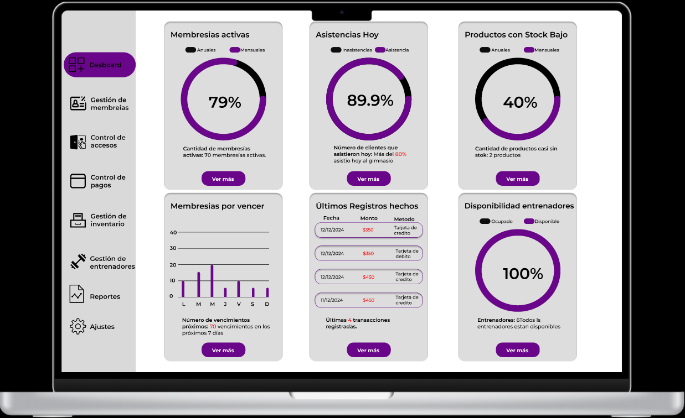

<table align="center">
    <tr>
        <td align="center" width="25%">
            
        </td>
        <td align="center" width="75%">
          
# GymYa
          
</table>

  GymYa es un entorno que facilita y hace mas comoda la forma en que se administra un gimnasio,
    automatizando los pagos y las entradas de los clientes al igual que permite llevar un control eficiente
    de estos mismos y un inventario de productos asi como un putno de venta adecuado para sus necesidades
   

    

## Gestion de membresias

Inscripción de Nuevos Clientes: Los administradores pueden registrar nuevos clientes ingresando sus datos personales y asignándoles una membresía específica (mensual, anual, etc.).
Reinscripción de Membresías: Los administradores serán notificados de los vencimientos de membresías próximas, con la opción de permitir la renovación de membresías a través de la aplicación o en el mostrador.
Cancelación o Suspensión de Membresía: Los administradores podrán gestionar las solicitudes de cancelación o suspensión de membresías, tanto por parte de los clientes como de forma interna.
Historial de Membresías: Visualización completa de todas las membresías activas, vencidas o suspendidas, con detalles de fechas y estado de las membresías.

## Control de accesos

Monitorización de Entradas y Salidas: Los administradores pueden registrar el check-in de los clientes mediante la lectura de códigos QR al ingresar al gimnasio.
Historial de Asistencias: Consultar el registro de todas las entradas y salidas de los clientes, permitiendo un control detallado de las visitas diarias.
Notificaciones de Membresía Expirada: Generación de alertas automáticas cuando un cliente intente ingresar con una membresía expirada, sugiriendo opciones para su renovación.

## Gestion de pagos

Pagos en Línea: Los administradores pueden gestionar pagos realizados a través de la aplicación (tarjetas de crédito, débito, transferencia bancaria).
Registro de Pagos en Mostrador: Los administradores pueden registrar pagos realizados en el gimnasio (efectivo o tarjeta física).
Historial de Pagos: Los administradores tienen acceso al historial completo de pagos realizados por los clientes, tanto en línea como en el gimnasio.

## Gestion de inventario

Catálogo de Productos: Los administradores gestionan el catálogo de productos disponibles en el gimnasio (suplementos, ropa, accesorios, etc.).
Control de Inventario: Los administradores pueden monitorear el inventario en tiempo real, asegurándose de que haya suficiente stock y activando alertas cuando sea necesario reponer productos.
Añadir Nuevos Productos: Los administradores tienen la capacidad de agregar nuevos productos al inventario, ingresando información detallada (nombre, cantidad, precio, etc.).
Historial de Compras: Los administradores pueden consultar el historial de ventas, tanto realizadas en línea como en el mostrador.

## Gestion de entrenadores y horarios

Gestionar Horarios de Entrenadores: Los administradores pueden modificar los horarios de los entrenadores y registrar sus ausencias.
Notificaciones de Disponibilidad: Los administradores reciben notificaciones cuando un entrenador no puede cumplir con su disponibilidad o cuando hay un ajuste necesario en el horario.
Asignación de Entrenadores a Clientes: Los administradores gestionan la asignación de entrenadores a clientes, si es necesario, en función de la disponibilidad.

## Notificaciones y comunicaciones

Notificaciones de Membresías: Los administradores pueden enviar notificaciones sobre la renovación de membresías a los clientes.
Promociones y Ofertas: Los administradores envían notificaciones sobre promociones especiales, descuentos y nuevas ofertas de productos.
Comunicación Directa con Clientes: Los administradores pueden responder preguntas de los clientes a través de un canal de mensajería interno o chat.

## Reportes y analisis

Reportes de Membresías Activas y Vencidas: Generación de reportes detallados de las membresías activas, vencidas y próximas a vencer.
Reporte de Ingresos: Los administradores pueden ver los ingresos generados por la venta de membresías y productos, filtrando por fechas o tipo de pago.
Reporte de Inventario: Análisis del estado de inventario, destacando productos más vendidos y aquellos que necesitan reposición.
Reporte de Asistencias: Generación de reportes sobre la frecuencia de asistencia de los clientes, permitiendo a los administradores optimizar los recursos y horarios.

## Configuracion y gestion de cuentas

Gestión de Perfiles de Administradores: Los administradores pueden crear nuevos perfiles de usuarios, con permisos específicos para diferentes roles dentro del gimnasio (administradores, entrenadores, etc.).
Políticas de Gimnasio: Los administradores pueden definir y actualizar las políticas del gimnasio (horarios, normas de conducta, etc.).
Gestión de Pagos Automáticos: Los administradores pueden activar o desactivar pagos automáticos para clientes, facilitando su renovación continua.
